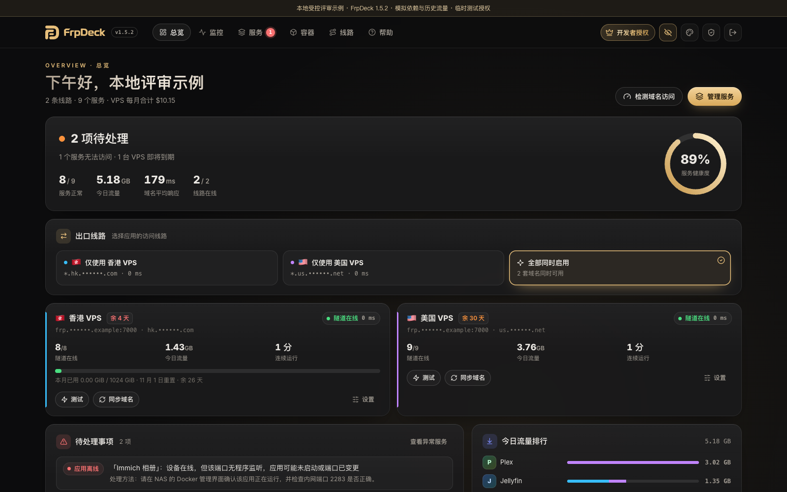
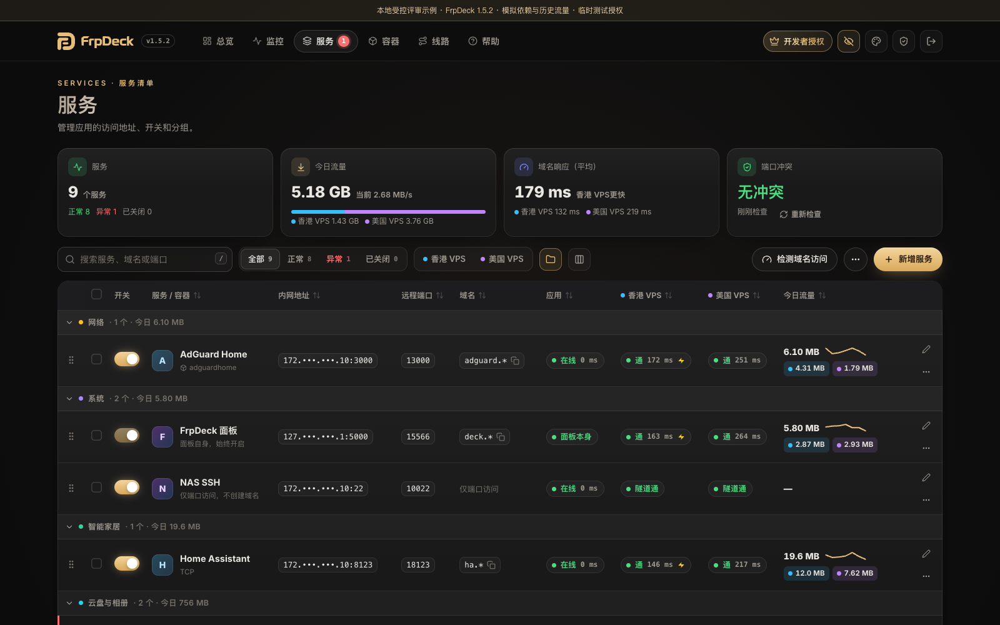
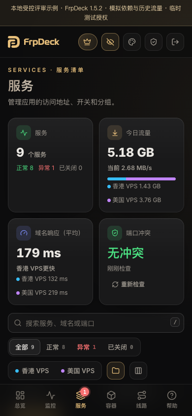

# FrpDeck

**NAS 多线路 frp 隧道管理面板。** 集中管理多台 VPS 的线路与 NAS 服务，联动 Lucky 配置 HTTPS 域名，查看连接状态、流量和线路诊断。

本仓库用于发布安装包、部署教程、更新说明和收集反馈，不包含 FrpDeck 应用源码。

[官网](https://frpdeck.playsong.cn/) · [网页部署教程](https://frpdeck.playsong.cn/guide.html) · [最新发布](https://github.com/songdone/FrpDeck-Release/releases/latest) · [安装说明](docs/INSTALL.md) · [问题反馈](https://github.com/songdone/FrpDeck-Release/issues)

## 下载与环境

当前版本：**1.6.0**，内置 frpc **0.64.0**。

| 部署方式 | 下载或镜像 | 状态 |
|---|---|---|
| Docker / Compose | `666uos/frpdeck:1.6.0`；[Compose 配置](https://github.com/songdone/FrpDeck-Release/releases/download/v1.6.0/docker-compose-1.6.0.yaml) | 常规部署方式；适用于具备 Docker 的 NAS / Linux 主机 |
| 飞牛 fnOS 手动安装 | [FrpDeck-1.6.0-fnos.fpk](https://github.com/songdone/FrpDeck-Release/releases/download/v1.6.0/FrpDeck-1.6.0-fnos.fpk) | **测试包，尚未通过官方应用中心审核**；实际验证范围见发布说明；完整生命周期验收仍待完成 |
| 完整部署手册 | [中文 PDF，8 页](https://github.com/songdone/FrpDeck-Release/releases/download/v1.6.0/FrpDeck-getting-started-1.6.0.pdf) | 覆盖 VPS/frps、Lucky、域名、NAS、非标准端口与 IPv6 |
| 文件校验 | [SHA256SUMS.txt](https://github.com/songdone/FrpDeck-Release/releases/download/v1.6.0/SHA256SUMS.txt) | 下载后核对文件完整性 |

GitHub 自动生成的 `Source code` ZIP/TAR 归档本发布仓库中的文档、图片和许可文件。安装请使用上表中的 FPK 或 Compose 配置。

Docker 镜像提供 `linux/amd64`、`linux/arm64`、`linux/arm/v7`。amd64 已在极空间 NAS 运行核验；arm64、arm/v7 本版尚未做真实硬件运行验收。镜像架构声明不代表每种 NAS 或 fnOS 真机均已测试。

用户自行准备 Docker、VPS/frps、域名、网络和 Lucky。已有公网条件的用户可按教程使用 NAS 上的 Lucky 直接访问。FrpDeck 不包含 Lucky，也不提供 VPS、域名或流量套餐。

## 安装

下载 Compose 配置，放入专用目录，按 [安装说明](docs/INSTALL.md) 启动。默认管理入口为 `http://NAS地址:15566`；首次设置密码来自容器日志或数据目录的 `initial-password.txt`。

配置使用持久目录保存管理员设置、线路、安装标识和授权。升级前备份整个数据目录；更新时保留该目录。

## 界面展示

以下为 **FrpDeck 1.5.2 受控运行示例**：FrpDeck 和 frps/frpc 实际运行，Lucky、NAS/Docker 信息和历史流量使用模拟依赖或示例数据。图片不作为飞牛真机完整验收结论。

## 功能与授权

- 线路与服务：管理多条 frp 线路、服务和外部访问，联动 Lucky 创建和开关域名规则；每条线路使用自己的域名。
- 状态与诊断：检查隧道、域名、HTTPS、证书、外网访问和端口，提供处理建议。
- 流量与提醒：流量趋势、额度、计费方式、UTC 重置和 VPS 到期提醒。
- 可选消息推送：企业微信、钉钉、飞书、Server酱、Bark、Telegram、通用 Webhook。
- 付费功能：多线路切换、批量选线、容器与 VPS 端口发现、一键加入服务、端口冲突修复及旧 frpc 容器迁移。
- 使用与安全：电脑/手机界面、PWA、深浅主题、随机首次设置密码、两步验证、登录限流及局域网访问限制。

| 版本 | 首发价 | 正常售价 | 授权设备 | 线路 / 服务 |
|---|---|---|---|---|
| 基础版 | 免费 | 免费 | 不限安装数量 | 1 条线路 / 服务不限 |
| Pro 专业版 | **¥8.8** | ¥18 | 1 台 NAS | 线路与服务不限 |
| Family 家庭版 | **¥18** | ¥28 | 3 台 NAS | 线路与服务不限 |

首发优惠截至 **2026-11-10 当日结束**。付费授权永久有效，包含后续版本更新，并在本机离线验证；VPS、域名等第三方费用由用户自行承担。专业版与家庭版功能相同，区别为设备数量。[许可协议](LICENSE) · [第三方组件说明](THIRD_PARTY_NOTICES.md) · [购买与售后](https://t.me/Play_6uos)

## FD2 授权与活动

1.6.0 统一使用 FD2，拒绝旧 FD1 和仅安装编号的兼容码。永久码在本机离线校验；FDV 活动资格码需在 FrpDeck 授权页规定日期内首次联网兑换，未兑换资格到期失效，成功兑换后的永久授权继续有效。当前活动关闭，发布时间不代表限免已经开始。

后台按 Docker 引擎记录全站活动授权，清空应用数据、更换安装编号不会再次取得一份活动授权。保留原数据及同一引擎的正常升级可继续使用；机器码变化请恢复备份或联系作者审核。软件标识不能证明物理设备或真实个人唯一，已下发的离线永久码不能远程撤销。

首次兑换、参加开放活动和在线找回需连接 `fdkey.playsong.cn`，提交安装编号、引擎编号及所需资格码，不提交线路、服务配置、VPS 令牌或流量。

## 权限与数据

容器默认以 root 运行。随附 Compose 挂载 Docker socket，以发现和迁移既有容器；即使挂载为 `:ro`，Docker API 仍具备停止、启动等容器管理能力。长期仅使用基础版时可移除该挂载，相应发现和迁移能力将不可用；FD2 授权必须能够读取 Docker 引擎编号。

线路凭据、管理员信息、授权和可选推送配置保存在本机数据目录。只有启用相关推送后才向配置的第三方发送通知。详细联网和权限说明见 [官网许可与隐私页](https://frpdeck.playsong.cn/legal.html)。

## 更新与反馈

[更新记录](CHANGELOG.md) · [常见问题](docs/FAQ.md)

反馈请说明 NAS 型号、系统、应用版本、部署方式、操作步骤和实际表现。截图请遮挡服务器地址、账号、机器码和授权码；不要公开密码、OpenToken 或 Webhook Token。

FrpDeck 与 frp、Lucky 官方无隶属关系。飞牛测试 FPK 为开发者提供的手动安装包，官方应用中心上架状态以飞牛公布为准。

当前 FPK 尚需核对或整改飞牛正式申请表的非 root 权限和付费内容体验期要求；自有鉴权、可运行的镜像及包级 package 用户声明不等于已满足全部上架要求。
